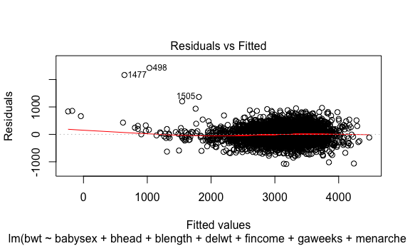
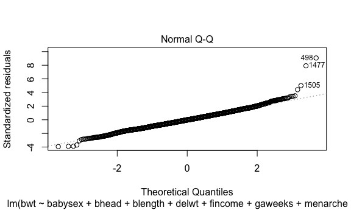
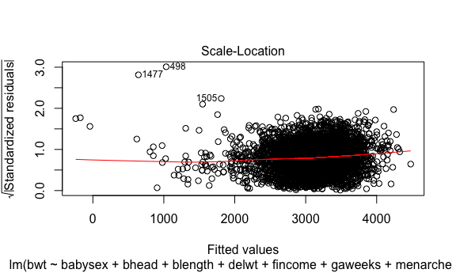
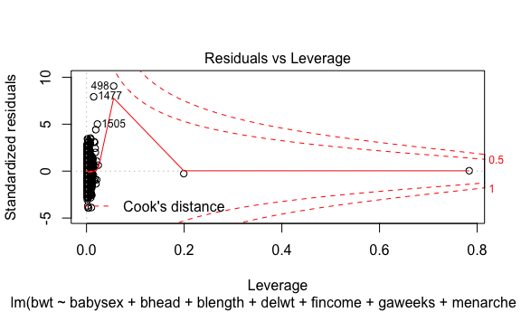
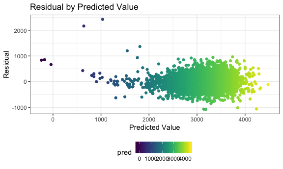
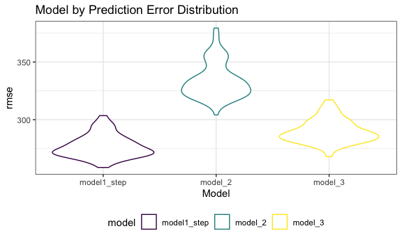

Homework 6
================

# Problem 1: tidying

``` r
## load in dataset

birth_data = 
  read_csv(file = "./data/birthweight.csv")
```

    ## Parsed with column specification:
    ## cols(
    ##   .default = col_double()
    ## )

    ## See spec(...) for full column specifications.

``` r
## clean dataset and convert categorical variables to factors
birth_data %>%
  janitor::clean_names() %>%
  mutate(babysex = as.factor(babysex),
         frace = as.factor(frace),
         malform = as.factor(malform),
         mrace = as.factor(mrace))
```

    ## # A tibble: 4,342 x 20
    ##    babysex bhead blength   bwt delwt fincome frace gaweeks malform menarche
    ##    <fct>   <dbl>   <dbl> <dbl> <dbl>   <dbl> <fct>   <dbl> <fct>      <dbl>
    ##  1 2          34      51  3629   177      35 1        39.9 0             13
    ##  2 1          34      48  3062   156      65 2        25.9 0             14
    ##  3 2          36      50  3345   148      85 1        39.9 0             12
    ##  4 1          34      52  3062   157      55 1        40   0             14
    ##  5 2          34      52  3374   156       5 1        41.6 0             13
    ##  6 1          33      52  3374   129      55 1        40.7 0             12
    ##  7 2          33      46  2523   126      96 2        40.3 0             14
    ##  8 2          33      49  2778   140       5 1        37.4 0             12
    ##  9 1          36      52  3515   146      85 1        40.3 0             11
    ## 10 1          33      50  3459   169      75 2        40.7 0             12
    ## # … with 4,332 more rows, and 10 more variables: mheight <dbl>,
    ## #   momage <dbl>, mrace <fct>, parity <dbl>, pnumlbw <dbl>, pnumsga <dbl>,
    ## #   ppbmi <dbl>, ppwt <dbl>, smoken <dbl>, wtgain <dbl>

``` r
## check for missing data

birth_data %>%
  map_df(~sum(is.na(.)))
```

    ## # A tibble: 1 x 20
    ##   babysex bhead blength   bwt delwt fincome frace gaweeks malform menarche
    ##     <int> <int>   <int> <int> <int>   <int> <int>   <int>   <int>    <int>
    ## 1       0     0       0     0     0       0     0       0       0        0
    ## # … with 10 more variables: mheight <int>, momage <int>, mrace <int>,
    ## #   parity <int>, pnumlbw <int>, pnumsga <int>, ppbmi <int>, ppwt <int>,
    ## #   smoken <int>, wtgain <int>

I loaded the dataset, cleaned it as appropriate data types, and checked
for missing values. There are none so I can proceed with analyses.

## stepwise linear model

I am using a stepwise model building process to test what variables are
associated with birth weight in my dataset. I

``` r
set.seed(10)
# pulling all of my variables into one equation
model_1 = lm(bwt ~ ., data = birth_data)

# doing a stepwise model selection based on AIC
model1_step = stepAIC(model_1, direction = "both", trace = FALSE) 

# summarizing the above model
summary(model1_step) 
```

    ## 
    ## Call:
    ## lm(formula = bwt ~ babysex + bhead + blength + delwt + fincome + 
    ##     gaweeks + menarche + mheight + momage + mrace + parity + 
    ##     ppwt + smoken, data = birth_data)
    ## 
    ## Residuals:
    ##      Min       1Q   Median       3Q      Max 
    ## -1081.54  -184.11    -3.95   174.35  2425.63 
    ## 
    ## Coefficients:
    ##               Estimate Std. Error t value Pr(>|t|)    
    ## (Intercept) -6246.3672   143.1342 -43.640  < 2e-16 ***
    ## babysex        32.3171     8.5453   3.782 0.000158 ***
    ## bhead         134.4298     3.4681  38.761  < 2e-16 ***
    ## blength        76.3760     2.0376  37.484  < 2e-16 ***
    ## delwt           3.9564     0.3985   9.929  < 2e-16 ***
    ## fincome         0.6597     0.1773   3.721 0.000201 ***
    ## gaweeks        12.0396     1.4803   8.133 5.42e-16 ***
    ## menarche       -4.3140     2.9211  -1.477 0.139792    
    ## mheight         5.4408     1.8125   3.002 0.002699 ** 
    ## momage          3.4549     1.1923   2.898 0.003778 ** 
    ## mrace         -53.4990     6.0167  -8.892  < 2e-16 ***
    ## parity         89.9677    40.9125   2.199 0.027929 *  
    ## ppwt           -2.8323     0.4367  -6.486 9.79e-11 ***
    ## smoken         -3.7116     0.5814  -6.384 1.90e-10 ***
    ## ---
    ## Signif. codes:  0 '***' 0.001 '**' 0.01 '*' 0.05 '.' 0.1 ' ' 1
    ## 
    ## Residual standard error: 275.5 on 4328 degrees of freedom
    ## Multiple R-squared:  0.7116, Adjusted R-squared:  0.7107 
    ## F-statistic: 821.4 on 13 and 4328 DF,  p-value: < 2.2e-16

``` r
# bwt = babysex + bhead + blength + delwt + fincome + gaweeks + mheight + mrace + parity + ppwt + smoken

# plotting the residuals
plot(model1_step, scale = "r2")
```

    ## Warning in plot.window(...): "scale" is not a graphical parameter

    ## Warning in plot.xy(xy, type, ...): "scale" is not a graphical parameter

    ## Warning in axis(side = side, at = at, labels = labels, ...): "scale" is not
    ## a graphical parameter
    
    ## Warning in axis(side = side, at = at, labels = labels, ...): "scale" is not
    ## a graphical parameter

    ## Warning in box(...): "scale" is not a graphical parameter

    ## Warning in title(...): "scale" is not a graphical parameter

    ## Warning in plot.xy(xy.coords(x, y), type = type, ...): "scale" is not a
    ## graphical parameter

    ## Warning in title(sub = sub.caption, ...): "scale" is not a graphical
    ## parameter



    ## Warning in plot.window(...): "scale" is not a graphical parameter

    ## Warning in plot.xy(xy, type, ...): "scale" is not a graphical parameter

    ## Warning in axis(side = side, at = at, labels = labels, ...): "scale" is not
    ## a graphical parameter
    
    ## Warning in axis(side = side, at = at, labels = labels, ...): "scale" is not
    ## a graphical parameter

    ## Warning in box(...): "scale" is not a graphical parameter

    ## Warning in title(...): "scale" is not a graphical parameter

    ## Warning in title(sub = sub.caption, ...): "scale" is not a graphical
    ## parameter



    ## Warning in plot.window(...): "scale" is not a graphical parameter

    ## Warning in plot.xy(xy, type, ...): "scale" is not a graphical parameter

    ## Warning in axis(side = side, at = at, labels = labels, ...): "scale" is not
    ## a graphical parameter
    
    ## Warning in axis(side = side, at = at, labels = labels, ...): "scale" is not
    ## a graphical parameter

    ## Warning in box(...): "scale" is not a graphical parameter

    ## Warning in title(...): "scale" is not a graphical parameter

    ## Warning in plot.xy(xy.coords(x, y), type = type, ...): "scale" is not a
    ## graphical parameter

    ## Warning in title(sub = sub.caption, ...): "scale" is not a graphical
    ## parameter



    ## Warning in plot.window(...): "scale" is not a graphical parameter

    ## Warning in plot.xy(xy, type, ...): "scale" is not a graphical parameter

    ## Warning in axis(side = side, at = at, labels = labels, ...): "scale" is not
    ## a graphical parameter
    
    ## Warning in axis(side = side, at = at, labels = labels, ...): "scale" is not
    ## a graphical parameter

    ## Warning in box(...): "scale" is not a graphical parameter

    ## Warning in title(...): "scale" is not a graphical parameter

    ## Warning in plot.xy(xy.coords(x, y), type = type, ...): "scale" is not a
    ## graphical parameter

    ## Warning in title(sub = sub.caption, ...): "scale" is not a graphical
    ## parameter



``` r
# plot model residuals against fitted values

birth_data %>%
  add_predictions(model1_step) %>%
  add_residuals(model1_step) %>%
  ggplot(aes(x = pred, y = resid, color = pred)) +
  geom_point() +
  viridis::scale_color_viridis(discrete = FALSE) +
  labs(x = "Predicted Value",
       y = "Residual",
       title = "Residual by Predicted Value")
```

 The
variables selected into the model are: baby’s sex, baby head
circumference, baby’s length at birth, mother’s weight at delivery,
family income, gestional age in weeks, mother’s height, mother’s race,
number of live births prior to pregnancy, mother’s pre-pregnancy weight,
and average number of cigarettes smoked per day during pregnancy.

The residuals demonstrate a slight skew as they are centered to the
right, but the cluster itself does not have a distinguishable pattern.

## cross validation

``` r
# model 2 from problem set
model_2 = lm(bwt ~ blength + gaweeks, data = birth_data) %>%
  broom::tidy()

# model 3 from problem set
model_3 = lm(bwt ~ bhead*blength*babysex, data = birth_data) %>%
  broom::tidy()

# create cross val data frame
 cross_val = 
   crossv_mc(birth_data, 100) %>%
   mutate(
     train = map(train, as_tibble),
     test = map(test, as_tibble)
   )

# actual cross val of the three models to find best model
crossval = 
  cross_val %>%
  mutate(model1_step = map(train, ~lm(bwt ~ ., data = .x) %>%
                         stepAIC(direction = "both", trace = FALSE)),
         model_2 = map(train, ~lm(bwt ~ blength + gaweeks, data = .x)),
         model_3 = map(train, ~lm(bwt ~ bhead + blength + babysex + bhead*blength + bhead*babysex + blength*babysex + bhead*babysex*blength, data = .x))) %>%
  mutate(rmse_model1_step = map2_dbl(model1_step, test, ~rmse(model = .x, data = .y)),
         rmse_model_2 = map2_dbl(model_2, test, ~rmse(model = .x, data = .y)),
         rmse_model_3 = map2_dbl(model_3, test, ~rmse(model = .x, data = .y)))

crossval
```

    ## # A tibble: 100 x 9
    ##    train test  .id   model1_step model_2 model_3 rmse_model1_step
    ##    <lis> <lis> <chr> <list>      <list>  <list>             <dbl>
    ##  1 <tib… <tib… 001   <lm>        <lm>    <lm>                273.
    ##  2 <tib… <tib… 002   <lm>        <lm>    <lm>                291.
    ##  3 <tib… <tib… 003   <lm>        <lm>    <lm>                278.
    ##  4 <tib… <tib… 004   <lm>        <lm>    <lm>                294.
    ##  5 <tib… <tib… 005   <lm>        <lm>    <lm>                268.
    ##  6 <tib… <tib… 006   <lm>        <lm>    <lm>                284.
    ##  7 <tib… <tib… 007   <lm>        <lm>    <lm>                268.
    ##  8 <tib… <tib… 008   <lm>        <lm>    <lm>                273.
    ##  9 <tib… <tib… 009   <lm>        <lm>    <lm>                268.
    ## 10 <tib… <tib… 010   <lm>        <lm>    <lm>                271.
    ## # … with 90 more rows, and 2 more variables: rmse_model_2 <dbl>,
    ## #   rmse_model_3 <dbl>

``` r
# prediction error distribution for each model

crossval %>%
  pivot_longer(
    rmse_model1_step:rmse_model_3,
    names_to = "model",
    values_to = "rmse",
    names_prefix = "rmse_") %>%
  mutate(model = fct_inorder(model)) %>%
  ggplot(aes(x = model, y = rmse, color = model)) +
  geom_violin(aes(color = model)) +
  viridis::scale_color_viridis(discrete = TRUE) +
  labs(
    x = "Model",
    y = "rmse",
    title = "Model by Prediction Error Distribution"
  )
```


Given the high interpretability of each of these models, I will look at
predicted error distributino to choose my model. Based on the violin
plots above, model 1 provides the lowest predicted error distribution. I
will choose the stepwise model I created as it has the lowest error, and
through the stepwise process it has the smallest AIC and biggest log
likelihood with the fewest number of parameters.

Model chosen: y = \(/beta_0\) + \(\beta_1\)babysex + \(\beta_2\)bhead +
\(\beta_3\)blength + \(\beta_4\)delwt + \(\beta_5\)fincome +
\(\beta_6\)gaweeks + \(\beta_7\)meight + \(\beta_8\)momage +
\(\beta_9\)mrace + \(\beta_10\)parity + \(\beta_11\)ppwt +
\(\beta_12\)smoken

Model chosen: y = -6246.367 + 32.317babysex + 134.4298head +
76.376blength + 3.956delwt + 0.6597fincome + 12.039gaweeks + 5.44meight
+ 3.454momage + -53.499mrace + 89.967parity + -2.832ppwt + -3.711smoken

# Problem 2

``` r
# loading in weather dataset
weather_df = 
  rnoaa::meteo_pull_monitors(
    c("USW00094728"),
    var = c("PRCP", "TMIN", "TMAX"), 
    date_min = "2017-01-01",
    date_max = "2017-12-31") %>%
  mutate(
    name = recode(id, USW00094728 = "CentralPark_NY"),
    tmin = tmin / 10,
    tmax = tmax / 10) %>%
  dplyr::select(name, id, everything())
```

    ## Registered S3 method overwritten by 'crul':
    ##   method                 from
    ##   as.character.form_file httr

    ## Registered S3 method overwritten by 'hoardr':
    ##   method           from
    ##   print.cache_info httr

    ## file path:          /Users/hannahbowlin/Library/Caches/rnoaa/ghcnd/USW00094728.dly

    ## file last updated:  2019-09-26 10:22:50

    ## file min/max dates: 1869-01-01 / 2019-09-30
